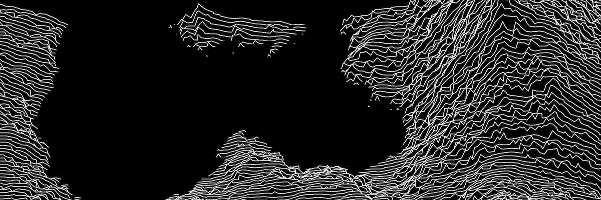

LANDSCAPE 0.5-SNAPSHOT
======================

> Fractal Landscape Generator  
> Written in Java by [**@grkvlt**](https://twitter.com/grkvlt).

This project was inspired by lockdown conversations with my friend
**B** about maths and science; during which I realised I had known about
the technique for twenty plus years but had never attempted to
implement it. I developed an initial rough working system in just a
few hours of hacking, and was very pleasantly surprised at the
quality of output from such a simple algorithm and
rendering technique.



After further modifications to produce images suitable for
[Twitter](https://twitter.com/grkvlt/status/1340028956179873793) I
also showed **B** the progress so far.  After a bit of live coding
to show them how the program worked, they suggested adding some
kind of _smoothing_ mechanism to create more natural looking plains.
I implemented our ideas as a low-pass filter based on the gradient,
described below.

I am _really_ happy with this project! The ratio of coding effort to
aesthetically pleasing pictures has been incredibly high so far,
and I intend to keep playing with the code and adding more features.
Future plans include implementing a more sophisticated renderer
with perspective, and displaying the output as a real-time fly-through
of the landscape...

<div class="page" />

## Usage

The program requires at least Java 8 with a Maven installation. It
has been optimised for use with OSX, but this is not essential. The
Jar file created can be executed without any other dependencies,
using the JRE `java` command.

Program arguments are optional, and are used to set configuration
for:
1. Roughness value
2. Number of images to generate
3. Image file prefix

## Example

```console
$ mvn clean install
[INFO] Scanning for projects...
[INFO] 
[INFO] ------------< landscape:landscape >------------
[INFO] Building Landscape 0.5-SNAPSHOT
...
$ java -jar ./target/landscape-0.5-SNAPSHOT.jar 2.174
+ Fractal landscape generator - Landscape 0.5-SNAPSHOT
+ Copyright 2020-2022 by Andrew Donald Kennedy
- Using 2.174 roughness and water 0.125
- Generating landscape over 6 iterations
...
```

## Algorithm

The code uses the diamond-square algorithm [1] for random midpoint
displacement to generate a height map representing the landscape.
The slope of each point is determined using a simplified approximation
of the vector calculus gradient operator.  A low-pass filter is
applied wherever the gradient is less than some threshold, by
averaging the points height with its neighbours, to produce smoother
surfaces.

The image is rendered in (pseudo) 3D by drawing a sequence of line
segments along the x-axis from left to right, with the y-axis showing
the height. Hidden surface removal is achieved simply due to the
order of operations and treating the line segments as the border
of a filled polygon. Finally some x-axis jitter is added to attempt
to alleviate the artifacts at cell boundaries that occur with this
algorithm.

## Code

An outline of the code flow is shown below; the variables used are as
defined in the `Images.java` [2] file.

```java
// Generate height map
double[][] points = landscape.generate(r, w, h);

// Differentiate height map
double[][] grad = landscape.differentiate(points);

// Smooth height map
double[][] smooth = landscape.smooth(points, grad, t, fi);

// Render and save image
BufferedImage image = landscape.render(smooth, scale, water, z, b);
String file = save(image, "PNG", ".", "landscape");
```

<div class="page" />

## References

The book _The Science of Fractal Images_ is an excellent text on
fractals, and was where I first learned about techniques for the
generation of realistic fractal landscapes using brownian _1/f_
noise. The papers listed in the Wikipedia article on the _Diamond-Square
Algorithm_ are also useful, and searching for this or _Midpoint
Displacement_ should result in many blog posts and articles suitable
for providing further inspiration.

- _Peitgen, Heinz-Otto_; _Dietmar, Saupe_ (1988).  
  **The Science of Fractal Images**  
  New York: Springer-Verlag.  
  ISBN [978-0-387-96608-3](https://www.springer.com/gb/book/9781461283492)
- _Fournier, Alain_; _Fussell, Don_; _Carpenter, Loren_ (June 1982).  
  **Computer Rendering of Stochastic Models**  
  Communications of the ACM. 25 (6): 371–384.  
  DOI [10.1145/358523.358553](https://doi.org/10.1145%2F358523.358553)
- _Miller, G. S. P._ (1986).  
  **The Definition and Rendering of Terrain Maps**  
  ACM SIGGRAPH Computer Graphics, 20(4), 39–48.  
  DOI [10.1145/15886.15890](https://doi.org/10.1145%2F15886.15890)

[1]: https://en.wikipedia.org/wiki/Diamond-square_algorithm
[2]: https://github.com/grkvlt/landscape/blob/master/src/main/java/landscape/Images.java#L58-L66

---
Copyright 2020-2022 by Andrew Donald Kennedy;
Licensed as [APACHE-2.0](http://www.apache.org/licenses/LICENSE-2.0)
